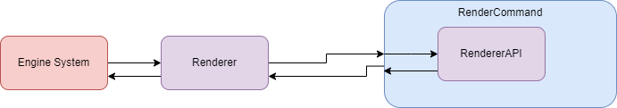

# Rendering System

## Overview
This document describes an approach to provide the engine with a rendering system that abstracts away from Render API specific details while still providing a while to interact at that level if need be. Additionally, it is design to be Render API agnostic, allowing different Render APIs to be used dynamically.

## Motivation
Currently ProjectGE does not have a proper rendering system for the engine. There is no way to render without picking a Render API (DX12) and directly calling API specific code. We want to be able to switch between renderers whenver we want. But we still want to be able to create/load all relevant resources (vertex buffer, shaders, textures). After this design we should be able to invoke render related commands, regardless of the render API and be able to draw on the scene

## Design

In thise design, there are three major components: 
- **Renderer**
- **RenderCommand**
- **RendererAPI**

**Renderer** is responsible for the high-level functionality of the Rendering System (e.g. Scene Recording & Material/Shader Setting). **Renderer** will make multiple low-level calls to perform its high-level task. All state **Renderer** will keep will be related to the virtual world being rendered (e.g. Camera Projection & Lighting Data). **RendererAPI** is responsible for handling low-level Render API specific logic. Each Render API will have its own version of a **RendererAPI** (e.g. DirectX12RendererAPI). **RendererAPI** will keep state required for the specific Render API's to render properly. **RenderCommand** is responsible for deferring low-level render calls to the current **RendererAPI** instance in use. **RendererCommand** will keep no state.

### Operations Included
#### High Level Operations
- Begin Scene
- Submit Object
- End Scene
#### Low Level Operations
- CreateVertexBuffer
- SetVertexBuffer
- CreateIndexBuffer
- SetIndexBuffer
- LoadShader
- SetShader
- SetPipelineState
- SetRenderTarget
- SubmitRecording

## Design Decisions
### Seperating High Level Rendering From Low Level Rendering
There are a couple of reasons it was decided to have a high level and low level renderer module:

1. Most of the engine will require high level tasks (e.g. render object), but a single mesh render is a multi-step process. This allows the engine to call a single command. 

2. Pieces of the engine that need to communicate with low level rendering command can directly use the command module to perform low level logic.

### Existence of RenderCommand

This engine needs to support dynamic switching between different renderers, this required taking advantage of polymorphism to holds different types of Render API implementations. RenderCommand allows us to keep global functions that can be called by any piece of engine code while deferring to a Render API specific implementation. 

Additionally, some Render API's require state tracking to operate properly (e.g. DX12's Command List System). Being able to hold an instance of **RendererAPI** instead of static functions and static memebers allows us to control when Render API begin to be used with state tracking. (e.g. Creating a DX12 device when we decide to use DX12 instead of loading it when the engine starts and not using DX12 for rendering)
