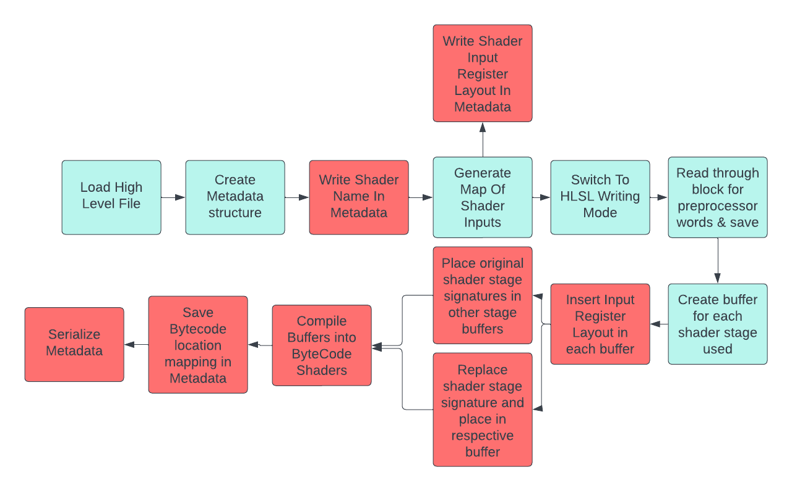
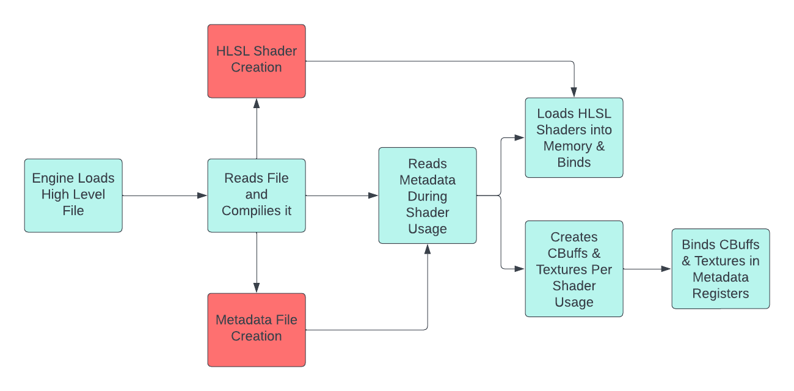

# Shader Creator System

## Overview
This document describes an approach to allow easier shader creation without needing to get too deep into the register arrangments being passed. This is using a  variant of Unity's ShaderLabs language to compile a proper hlsl file while allowing the engine to read the high level file for register binding.

## Motivation
HLSL shaders need to be made in according to exactly how the renderer will use it (e.g constant buffers belonging to a register that a engine will bind to). This requires the creator of the hlsl shader and the engine to both be in agreement on where data needs to be send. This results in either the engine decided where data needs to be binded to and shader creators grabbing exactly in those registers, or hlsl creators choosing registers and the engine reflecting on where data is being set. Both of these approaches are restricting on each party (engine needing to reflect on shaders or shader creators needing to make their shader inputs a certain way)

## Design
This system will utilize a high level language almost identical to Unity's ShaderLab:
```
Shader "name"{
    Input{
        codeName("stringName", typeName, defaultValue)
        ...
    }

    PROGRAM
    #pragma vertex vertfn
    #pragma pixel fragfn

    struct vertInput{};

    struct pixelInput{};

    pixelInput vertfn(vertInput in){
     // HLSL CODE HERE
    }

    float4 pixelInput(pixelInput in){
        //HLSL CODE HERE
    }
    ENDPROGRAM
}
```

The engine will read a file version of code like above and compile it into the appropriate hlsl shaders and metadata files to be used by the engine and game:



After compilation it will use both the compiled HLSL code and the Metadata file to properly load up a shader:


## Design Decisions

### Unity ShaderLab Language
The unity shaderlab langauge is an effective way to describe shaders without needing to be too detailed about registers. There is no need to re-invent the wheel when something this effective exists. If anything, node systems should be looked into if desired, to remove any need of coding knowledge for artists.

### Variant Version of Unity ShaderLabs
Currently this engine does not have any complicated features like `RenderPass`'s, `RenderState`'s, etc. This is not in scope of this design. This can be added later on though, once the engine supports chaning these features.